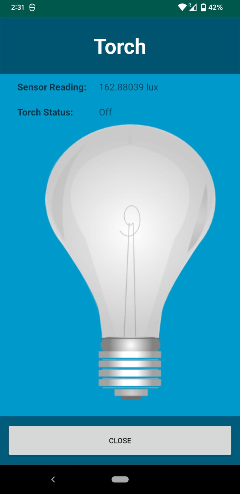

# 277_torchapp

### App is setup to torch will be on when sensor reading is less than 25 
### Sensor reading when torch is off. When sensor reading is 162

### Sensor reading when torch is on. When sensor reading is 22.

### Sensor reading when torch is on USB debugging mode.When sensor reading is 18. 

